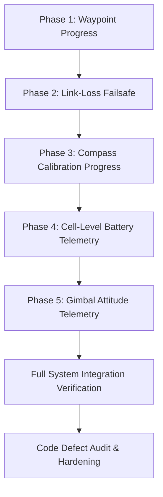

# Implementation Plan: DJI Telemetry & Safety Expansion

This document outlines the design and implementation plan for extending the DJI SDK mobile application with advanced telemetry features, C2 link-loss failsafe protection, and diagnostics streaming to achieve complete operational parity with the MAVLink C2 specifications.

---

## 1. Objectives & Features

| Feature | Target DJI SDK Key / API | Target MQTT Topic / Payload | MAVLink Equivalent |
| :--- | :--- | :--- | :--- |
| **Waypoint Progress** | `WaypointMissionManager.addWaypointMissionExecuteStateListener` | `dji-sdk/fleet/{clientId}/event` -> `KMZ_PROGRESS` | `MISSION_CURRENT` / `MISSION_ITEM_REACHED` |
| **Link-Loss Failsafe** | Heartbeat timer monitoring MQTT `PING` packets | Triggers native Go-Home or Auto-Land | `GCS Failsafe` |
| **Compass Calibration** | `CompassKey.KeyCompassCalibrationState` | `dji-sdk/fleet/{clientId}/event` -> `COMPASS_CALIBRATION` | `MAG_CAL_PROGRESS` / `MAG_CAL_REPORT` |
| **Cell Voltages** | `BatteryKey.KeyCellVoltages` | `dji-sdk/fleet/{clientId}/telemetry` -> `battery.cells` | `BATTERY_STATUS` |
| **Gimbal Attitude** | `GimbalKey.KeyAttitudeInDegrees` | `dji-sdk/fleet/{clientId}/telemetry` -> `gimbal` | `GIMBAL_ANGLE` / `VFR_HUD` |

---

## 2. Detailed Technical Design

### Phase 1: Waypoint Progress Reporting
1. **SDK Listener Registration:**
   Inside `MainActivity.kt`, register a listener to the native WPML execution engine:
   ```kotlin
   WaypointMissionManager.getInstance().addWaypointMissionExecuteStateListener(object : WaypointMissionExecuteStateListener {
       override fun onStateUpdate(state: WaypointMissionExecuteState?) {
           state?.let { updateWaypointProgress(it) }
       }
   })
   ```
2. **Telemetry Dispatch:**
   Map the current progress index and status:
   ```json
   {
     "event": "KMZ_PROGRESS",
     "timestamp": 1690000000000,
     "waypoint_index": 3,
     "execution_state": "EXECUTING",
     "target_speed": 5.4
   }
   ```

### Phase 2: Link-Loss Failsafe Monitor
1. **MQTT Keep-Alive Tracking:**
   Inside `MqttService.kt`, introduce a volatile timer or timestamp variable:
   ```kotlin
   @Volatile var lastGcsHeartbeatTime = System.currentTimeMillis()
   private val LINK_LOSS_TIMEOUT_MS = 15000L // 15 seconds
   ```
2. **Heartbeat Refresh:**
   Update `lastGcsHeartbeatTime` every time a `PING` payload is received over MQTT.
3. **Periodic Checker Task:**
   Run a scheduled thread or handler task every 2 seconds. If `System.currentTimeMillis() - lastGcsHeartbeatTime > LINK_LOSS_TIMEOUT_MS`, trigger the link-loss failsafe.
4. **Failsafe Action Execution:**
   - If the aircraft is flying (`isFlying == true`):
     - Trigger native Go-Home command:
       ```kotlin
       KeyManager.getInstance().performAction(KeyTools.createKey(FlightControllerKey.KeyStartGoHome), null)
       ```
     - Log failsafe event locally and publish a `LINK_LOSS_FAILSOUND` event.

### Phase 3: Compass Calibration Progress
1. **Key Registration:**
   Listen to DJI's native compass calibration progress keys:
   ```kotlin
   KeyManager.getInstance().listen(KeyTools.createKey(CompassKey.KeyCompassCalibrationState)) { oldVal, newVal ->
       newVal?.let { streamCompassCalibrationProgress(it) }
   }
   ```
2. **Event Payload:**
   Map native states (e.g. `HORIZONTAL_ROTATION`, `VERTICAL_ROTATION`, `SUCCESS`, `FAILED`) to MQTT event payloads.

### Phase 4: Cell-Level Battery Telemetry
1. **Polling key:**
   Add periodic polling of `BatteryKey.KeyCellVoltages` inside the telemetry collection thread.
2. **Telemetry Serialization:**
   Read the list of cell voltages (in millivolts) and output them under the `battery` block:
   ```json
   "battery": {
     "percentage": 87,
     "voltage": 22.8,
     "cells": [3812, 3810, 3814, 3811, 3815, 3810]
   }
   ```

### Phase 5: Gimbal Attitude Telemetry
1. **Polling key:**
   Retrieve real-time camera angles via `GimbalKey.KeyAttitudeInDegrees` for pitch, roll, and yaw.
2. **Telemetry Serialization:**
   Append parameters to `gimbal` key:
   ```json
   "gimbal": {
     "pitch": -45.2,
     "roll": 0.1,
     "yaw": 182.4
   }
   ```

---

## 3. Implementation Steps & Tasks



### Task List
- [x] **Task 1: Waypoint Execute State Listener**
  - Implement listener in `MainActivity.kt`.
  - Map status indices to JSON payloads and publish to MQTT event topic.
- [x] **Task 2: Link-Loss Failsafe Checker in MqttService**
  - Implement keeping track of `PING` timestamps.
  - Implement a runnable checker that calls Return-to-Home if the connection is lost.
- [x] **Task 3: Compass Calibration Observer**
  - Subscribe to `KeyCompassCalibrationState` and publish progress events.
- [x] **Task 4: Detailed Battery Cell voltages**
  - Read `KeyCellVoltages` and append to the standard telemetry JSON payload.
- [x] **Task 5: Gimbal Attitude Telemetry**
  - Read `KeyAttitudeInDegrees` and include current pitch/roll/yaw in telemetry.
- [x] **Task 6: Post-Implementation Defect Audit & Hardening**
  - Perform static code analysis and lint check (`./gradlew lintDebug` or similar).
  - Verify null safety and lifecycle leak prevention on all newly added listeners and background threads.
  - Conduct integration run/sim checks to verify thread termination on activity destroy.
